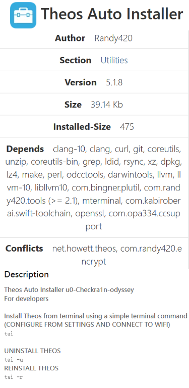
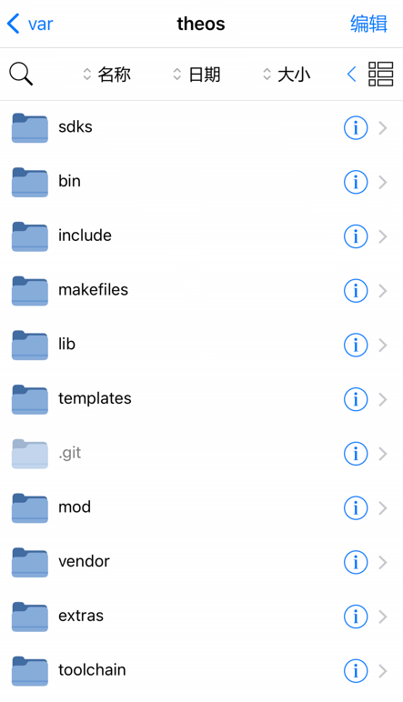
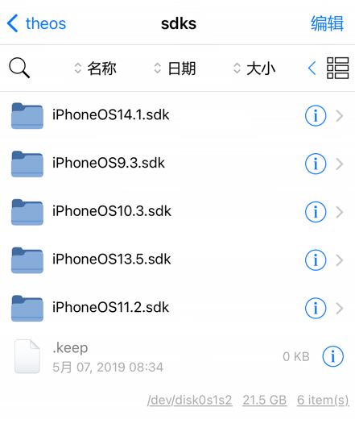

## theos for ios

* iOS手机端部署theos，适合有点基础的朋友，小白就绕道。

* 不答疑，仅做简单的分享，备份之用。

* 适用于iOS越狱(特指unc0ver越狱，其他工具越狱另寻他法)设备部署theos环境。

* 测试设备：iPhoneX iOS14.1 unc0ver越狱

* 首先请安装BigBoss源内的Theos Auto Installer_5.1.8(这个版本不会出错，不要安装作者源内的v5.2.2版本)

* 下载本项目的所有内容，放入var/theos(或者/theos)文件夹内

* 去[iOS-SDKs项目](https://github.com/xybp888/iOS-SDKs)下载sdk放入到var/theos/sdks/下

* 下载的sdk版本不要超过你当前机器的iOS版本(比如你设备当前是iOS14.1，那就只能iOS9/10/11/13各选一个sdk版本放入，且iOS14的sdk不能高于14.1)

